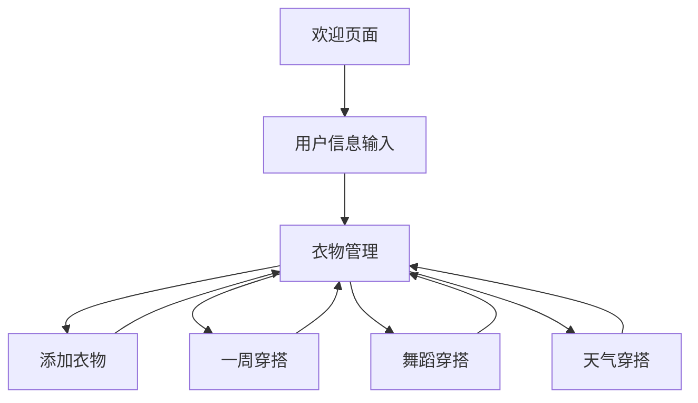

# 智能电子衣橱产品需求文档

## 1. 产品概述

智能电子衣橱是一款帮助用户管理衣物、生成个性化穿搭推荐的应用，旨在减少用户做决定的时间，提高穿搭效率，同时传达高审美标准。

- **解决问题**：用户日常穿搭决策困难，天气变化时穿搭调整不便，舞蹈课等特殊场合穿搭需求难以满足。
- **目标用户**：各类风格的女生，注重穿搭品质和效率。
- **产品价值**：通过智能推荐算法，结合用户身材、审美偏好、天气状况和特殊场合需求，为用户提供个性化的穿搭方案，节省时间，提升穿搭品质。

## 2. 核心功能

### 2.1 功能模块

| 模块名称 | 功能描述 |
|---------|----------|
| 用户信息管理 | 身高体重输入、身材类型选择、个人风格偏好设置、舞蹈课信息管理 |
| 衣物管理 | 拍照识别添加衣物、手动输入衣物信息、衣物分类管理、衣物详情查看 |
| 穿搭推荐 | 一周穿搭计划、天气穿搭推荐、舞蹈课穿搭推荐、场合穿搭推荐 |
| 天气集成 | 自动获取地理位置、天气信息、天气变化智能调整推荐、天气预警提醒 |
| 小红书风格参考 | 提取博主风格元素、个性化匹配、韩国女生穿搭趋势分析 |

### 2.2 页面详情

| 页面名称 | 模块名称 | 功能描述 |
|---------|---------|----------|
| 欢迎页面 | 用户信息输入 | 收集用户身高体重、身材类型、个人风格偏好、舞蹈课信息 |
| 衣橱首页 | 天气信息 | 展示今日天气状况，提供天气预警 |
| 衣橱首页 | 功能导航 | 快速访问添加衣物、一周穿搭、舞蹈穿搭、天气穿搭等功能 |
| 衣橱首页 | 衣物分类 | 按衣物类型（上衣、裤子、裙子、鞋子、配饰、帽子）进行分类浏览 |
| 衣橱首页 | 衣物展示 | 以衣柜分类收集所有衣物，点击以卡片形式展示用户已添加的衣物 |
| 衣橱首页 | 推荐穿搭 | 展示基于天气、上班方式（是否骑自行车）、是否健身、场合和用户偏好的穿搭推荐 |
| 衣物详情页 | 衣物信息 | 查看衣物详细信息，包括类型、颜色、风格等 |
| 穿搭详情页 | 穿搭信息 | 查看穿搭的详细组成、适合场合、天气建议等 |
| 个人中心 | 账户设置 | 管理用户个人信息（身高体重位置）、隐私设置等 |

## 3. 核心流程

### 用户首次使用流程
1. 用户打开应用，进入欢迎页面
2. 输入身高体重信息
3. 选择身材类型（梨型、苹果型、H型、沙漏型）
4. 选择个人风格偏好（休闲、运动、复古、极简、街头、优雅、老钱风、美式、韩系）
5. 设置舞蹈课信息（舞种、时间、是否工作日课程）
6. 完成信息输入，进入衣橱首页

### 日常使用流程
1. 用户打开应用，进入衣橱首页
2. 查看今日天气信息和推荐穿搭
3. 可选择添加新衣物（拍照识别或手动输入）
4. 查看一周穿搭计划
5. 查看舞蹈课穿搭推荐（每天晚上10点会确定第二天是否有舞蹈课）
6. 查看基于天气的穿搭建议
7. 浏览和管理已有衣物（加减新衣物并分类（季节、风格、使用场景）

